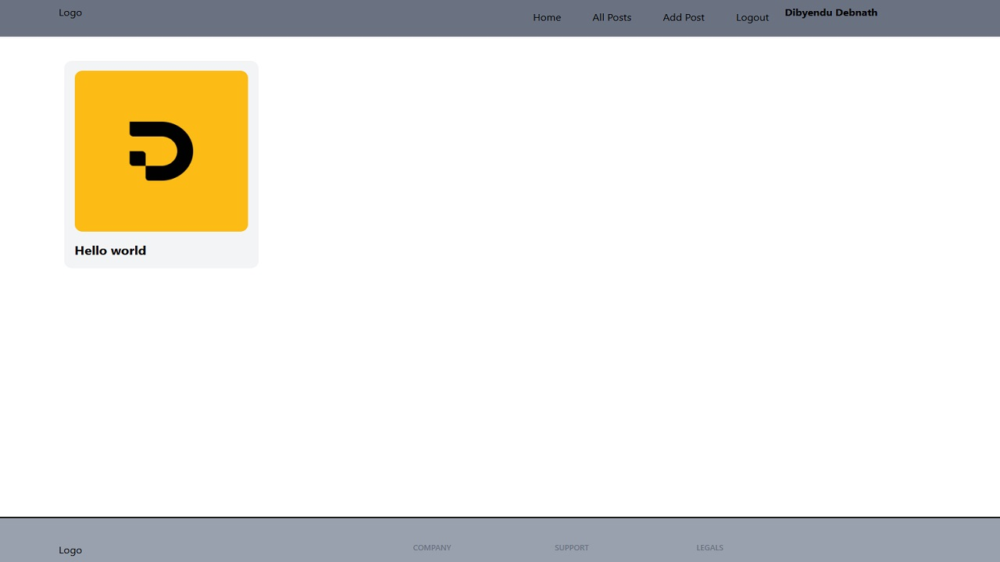

# 📝 FunBlogs

**FunBlogs** is a modern, full-stack blogging platform built with **React**, **Vite**, **Tailwind CSS**, **React-Redux**, and **React Router**, using **Appwrite** as the backend service. It allows users to **log in**, **create**, **read**, and **update blogs** with ease, all within a clean and intuitive UI.

🔗 [Live Demo](https://funblogs.netlify.app/)

---

## 📸 Screenshot



---

## ✨ Features

- 🔐 User Authentication (Appwrite)
- 📝 Create, Read, and Update Blogs
- 🌐 Dynamic Routing with React Router
- ⚛️ Global State Management using Redux Toolkit
- 💨 Tailwind CSS for modern, responsive UI
- ⚡️ Lightning-fast performance with Vite
- 📦 Clean component-based architecture
- 🧠 Custom hooks and modular structure

---

## 🛠 Tech Stack

| Frontend      | Backend       | Styling       | Other Tools         |
|---------------|---------------|----------------|----------------------|
| React         | Appwrite      | Tailwind CSS  | React Router         |
| Vite          |               |               | React-Redux Toolkit  |
| JavaScript    |               |               | Netlify (Hosting)    |

---

## 🚀 Getting Started

### 1. Clone the repository

```bash
git clone https://github.com/dibyendu-git-platform/blog-app.git
cd funblogs
npm install
npm run dev
